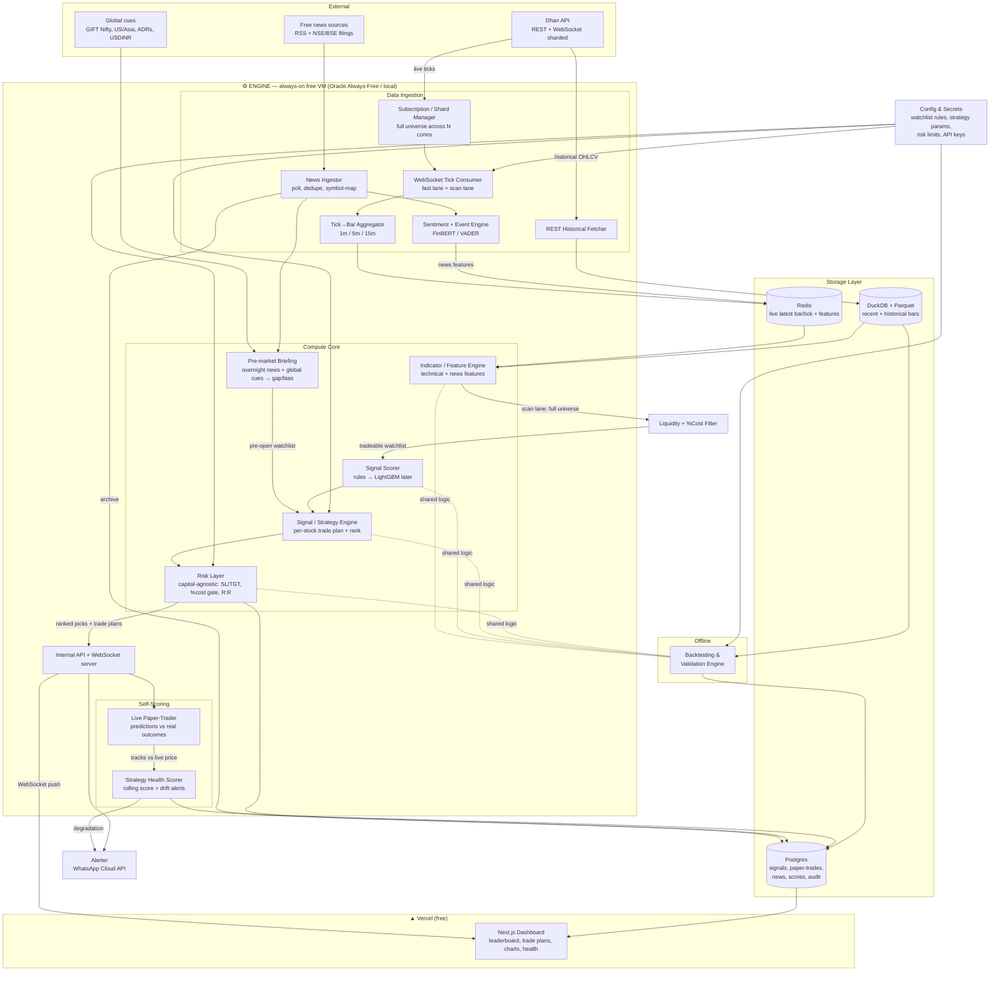

# Intraday Signal Engine for Indian Equities — Build Plan (Blueprint)

> **Status:** Design blueprint only. No application code yet.
> **Last updated:** 2026-06-23
> **Author/owner:** Solo developer (you), single-user system to start.

> ⚠️ **Read this first.** This document describes a **personal decision-support tool**. It suggests; **you decide and you place every order**. Intraday trading carries real and frequently total loss of capital. Generated signals are **not** investment advice and carry **no guarantee**. See §9 (Risks & Compliance).

---

## 0. Assumptions (defaults — correct any of these later)

These are the load-bearing assumptions. I've picked sensible defaults so you can start; each is a knob you can turn.

| # | Assumption | Default chosen | Why / impact if wrong |
|---|------------|----------------|------------------------|
| A1 | **Data source / broker** | ✅ **LOCKED: Dhan API** (free) for live + historical. | Confirmed — you hold a Dhan account. Free, working websocket + historical bars, generous instrument caps for full-universe ingestion. Behind a `BrokerAdapter` so a future paid swap (Kite / vendor) is one file. Upstox kept only as a documented fallback. |
| A2 | **Latency** | **Minimize end-to-end latency from day one. Target tens-of-ms in the hot path** (tick → indicator → signal), low-hundreds-of-ms tick→alert. First-class design constraint. | Intraday edge decays fast. Lean hot path: async non-blocking ingestion, in-memory rolling state, vectorized/incremental indicators, **zero synchronous DB writes/logging on the hot path**, compiled escape hatch if profiling demands. *Not* HFT/co-location (different ₹₹₹/C++ regime) — we remove *avoidable* latency within a retail stack. |
| A3 | **Asset universe** | ✅ **LOCKED: entire NSE cash market** (~2,000 symbols), BSE excluded. All ingested + analyzed; **tradeable** set is a dynamically-filtered liquid subset. | Confirmed NSE-only — covers ~all liquidity, halves sharding effort vs. adding BSE. **Scan wide, rank narrow** (§4.0): scan everything, surface only liquid, tradeable names as a ranked leaderboard. Forces scale decisions: websocket sharding (§3.3), vectorized/Polars compute (§7), scale-appropriate storage (§3.6). |
| A4 | **Capital model** | ✅ **CHANGED → capital-agnostic.** The tool **does not assume a capital size and does not place rupee-sized positions.** It outputs, per stock: **entry, target(s), stop-loss, direction, confidence, and the % move / R:R** — *you* decide how much money to deploy. | Per your call: "only suggest stocks and entry/exit points; I decide money from the data." This **simplifies** the system — drops ₹50k-specific affordability/leverage caps. Risk management shifts from rupee position-sizing to a **capital-agnostic, percentage-based framework** + an *optional* calculator where you enter capital to get a share count (§5.1). Cost/edge gate becomes **%-based breakeven analysis** (§5.4). |
| A5 | **Hosting** | **Split deployment (both free):** dashboard/frontend on **Vercel**; the always-on **engine on a free always-on VM** (recommend **Oracle Cloud Always Free** — ARM, up to 4 vCPU/24 GB free forever, Mumbai region) *or your own machine during market hours*. | ⚠️ **Architect's note (important): Vercel CANNOT host the engine.** Vercel is serverless — stateless functions with execution time limits, **no persistent websocket connections, no always-on background processes**. The engine must hold Dhan's websocket open 09:15–15:30, keep in-memory state, and run a scan loop — that needs a real always-on process. **Solution:** Vercel for the Next.js dashboard (free, its sweet spot) + Oracle Always-Free VM (or local box) for the engine (free, in Mumbai → low latency, supports A2). Whole stack stays ₹0. See §7.1. |
| A6 | **Budget** | **~₹0/mo**: free Dhan API + free Oracle/Local engine host + free Vercel + free WhatsApp Cloud API tier + open-source everything. | The only realistic cost is brokerage on real trades you choose to place. |
| A7 | **Trading style** | **Suggestion-only, human-in-the-loop.** Outputs ranked picks + trade plans; **you** place every order. Continuous **paper-trading + self-scoring** running underneath (A10). | No auto-execution. You're the executor and risk-decider. Reduces technical *and* regulatory exposure (§9, personal-use). |
| A8 | **Segment** | **Equity cash / intraday (MIS-style)**, no options at MVP. | Options add greeks/chain complexity. Cash equity intraday is the clean start. |
| A9 | **Pre-market intelligence** | **Yes — a core feature.** Before the open (~08:00–09:10 IST), gather everything since last close (overnight news, global cues, GIFT Nifty, ADRs, corporate filings) and produce a **pre-market briefing + ranked gap/bias watchlist** (§4.8). | Per your call. A lot of intraday opportunity is set up overnight; a pre-open prediction primes the day's watchlist before the bell. |
| A10 | **Self-scoring health monitor** | **Yes — a core feature.** The system **paper-trades its own live predictions against real outcomes**, computes a rolling **Strategy Health Score**, and **alerts you when the score degrades** ("something's wrong, investigate"). | Per your call. This is the system's conscience — it tells you when the edge has decayed or a component broke, instead of you finding out via losses (§6.5–6.6). |

> **Tensions still in play — flagged honestly:**
> 1. **Full universe (A3) + lowest latency (A2):** resolved by a **fast lane** (tradeable watchlist, sub-second) vs. **scan lane** (full market on closed bars). §3.3 / §7.
> 2. **Capital-agnostic output (A4) vs. cost realism:** without a known capital we can't compute rupee position sizes, but we *can* and *must* still tell you whether a move clears costs — so the cost gate becomes **percentage-based** ("this setup needs to move ≥X% just to break even after charges"). A stock whose realistic intraday range can't clear costs is filtered out of the picks. §5.4.
> 3. **Vercel (A5) vs. an always-on engine:** Vercel can't run the engine; resolved by the **split deployment** above. §7.1.

If any of these are wrong, tell me and the relevant sections shift — but the architecture below does not.

---

## 1. Goals & Non-Goals

### Goals
- Ingest **live intraday market data** (ticks/quotes) across the **whole NSE cash market** during market hours.
- Compute a standard library of **intraday indicators** (VWAP, RSI, MACD, EMA, Supertrend, ADX, ORB, volume spikes) + **news/sentiment features** in near real-time.
- Run **modular, pluggable strategies** that produce, per stock, a complete **trade plan**: direction (LONG/SHORT), **entry, target(s), stop-loss, expected % move / R:R**, and a **0–100 confidence score** — **capital-agnostic** (no rupee sizing; you decide the money).
- Surface a **ranked "best intraday stocks" leaderboard** — the headline deliverable — so you see the top setups across the market at a glance (§11.1).
- Produce a **pre-market briefing** before the open: overnight news + global cues → a ranked gap/bias watchlist for the day (§4.8).
- Provide a **first-class, capital-agnostic risk framework**: stop/target logic, %-based cost-vs-edge gate, R:R floors, and guidance limits — applied *before* a pick is surfaced.
- **Backtest** strategies on historical intraday data with honest metrics and explicit anti-lookahead / anti-overfit discipline.
- **Continuously paper-trade the system's own live predictions** against real outcomes and maintain a **Strategy Health Score** that **alerts when performance degrades** (§6.5–6.6).
- Present a **real-time dashboard**: leaderboard, live picks with trade plans, per-stock charts with indicators + signal markers + news, pre-market view, and the health-score monitor.

### Non-Goals (explicitly out of scope, at least initially)
- ❌ **Auto-placing live orders.** The human places orders. (Auto-execution is a gated later phase, opt-in, paper-first.)
- ❌ **Being a SEBI-registered advisory / tips service.** This is a personal tool for one user. Distributing signals to others changes the legal picture entirely (§9).
- ❌ **HFT / sub-second / arbitrage / co-location.** Wrong latency regime for this stack.
- ❌ **Options, futures greeks, multi-leg strategies** at MVP.
- ❌ **Portfolio/positional (multi-day) investing.** This tool is intraday-only; everything is flat by 15:20.
- ❌ **Guaranteeing profit.** It surfaces probabilistic edges; many signals will lose.
- ❌ **Tax / accounting / P&L statements for filing.** Use broker statements for that.

---

## 2. High-Level Architecture



**Key architectural principle:** the **Indicator → Signal → Risk** core is shared *identically* between live trading and backtesting. The only thing that changes is the data feed (live websocket vs. historical replay). This is what makes backtests trustworthy and prevents "works in backtest, breaks live" drift.

**Deployment boundary:** the **engine** (ingestion + compute + self-scoring + API) runs as a long-lived process on a **free always-on VM** (Oracle Always-Free, Mumbai region, or your local machine during market hours). The **dashboard** is a **Next.js app on Vercel (free)** that talks to the engine's API over WebSocket/HTTPS. Vercel hosts *only* the UI — it cannot run the engine (A5, §7.1).

**Component responsibilities**
- **Ingestion** — owns the Dhan connection, normalizes ticks, aggregates bars, polls news + global cues, handles reconnects and market-hour gating.
- **Pre-market briefing** — before the open, fuses overnight news + global cues into a ranked gap/bias watchlist (§4.8).
- **Compute core** — stateless-per-bar where possible: bars + features → score → per-stock trade plan → ranked picks (capital-agnostic).
- **Self-scoring (feedback loop)** — paper-trades every live prediction against real outcomes and maintains the Strategy Health Score that alerts on degradation (§6.5–6.6).
- **Storage** — Redis (live state), Postgres (signals/paper-trades/news/scores/audit), DuckDB+Parquet (bars/backtest).
- **Backtesting** — replays historical bars through the *same* core, simulates fills with slippage/brokerage, reports metrics.
- **Delivery** — WebSocket-pushes live state to the Vercel dashboard; fires WhatsApp alerts.
- **Config** — single source of truth for watchlist rules, strategy params, risk limits; hot-reloadable where safe.

---

## 3. Data Layer

### 3.1 Broker / data API comparison (India)

| Criterion | **Zerodha Kite Connect** | **Upstox API** | **Dhan API** | Angel One SmartAPI |
|-----------|--------------------------|----------------|--------------|---------------------|
| API cost | ~₹2,000/mo (₹500 historical add-on bundled in current plans) | **Free** API for account holders | **Free** | **Free** |
| WebSocket live ticks | ✅ Mature, stable, LTP/quote/full modes | ✅ Yes | ✅ Yes | ✅ Yes |
| Max instruments on WS | ~3,000 (full mode fewer) | ~ couple thousand | Generous | Generous but flakier historically |
| Historical intraday | ✅ Up to 60 days of 1-min, longer for higher TFs (paid add-on) | ✅ Decent | ✅ Decent, improving | ✅ But quality/uptime complaints |
| Rate limits | ~3 req/s REST, documented | Documented, reasonable | Documented | Documented |
| Docs / community / libs | **Best** (`pykiteconnect`, huge community) | Good | Good, growing | Mixed |
| Reliability reputation | **Highest** | High | High | **Most complaints** re: uptime |
| Auth friction | Daily login token (TOTP automatable) | Daily token | Daily token | Daily token |

> All Indian retail broker APIs require a **daily access-token refresh** (SEBI/exchange login requirement). Plan for an automated morning login (TOTP) — there is no permanent API key for trading scope.

### 3.2 Decision (LOCKED: Dhan, per A1)

**Dhan API.** ✅ Confirmed — you hold a Dhan account. *One-line reason:* free, working websocket + historical bars, generous instrument allowance for full-universe (A3), and the `BrokerAdapter` keeps a future paid swap to one file. Use **Dhan's official Python SDK** (`dhanhq`) behind the adapter.

**Upgrade trigger (when to pay):** move to **Kite Connect** or a market-data vendor only on a measured limitation — websocket instrument cap forcing too many shards, historical depth too shallow for backtests, or feed instability. Data-driven, not default.

**Avoid Angel One as your *only* feed** due to recurring reliability complaints — fine as a backup/redundant feed later.

**Design for swappability:** put the broker behind a `BrokerAdapter` interface (`connect`, `subscribe(symbols)`, `on_tick(cb)`, `historical(symbol, tf, from, to)`, `quote(symbols)`). Switching brokers — or running two feeds (one for the fast lane, one for redundancy) — is then an adapter, not a rewrite.

### 3.3 Live data: ticks vs. bars — two-lane design (per A2 + A3)

Because we ingest the **whole market** (~2,000+ symbols) but want **lowest latency** on what we actually trade, the feed is split into two lanes:

- **Fast lane — the tradeable watchlist** (the dynamically-filtered liquid subset, typically a few dozen symbols): subscribe in **full/quote mode** for LTP, volume, depth. Tick→signal runs on every relevant update with minimal buffering. This is the latency-critical path (A2).
- **Scan lane — the full universe:** subscribe in the lightest mode the feed allows (LTP/minimal). Indicators run on **closed 1-min bars** in vectorized batches. Slightly relaxed latency is acceptable here — its job is to *promote* symbols into the fast-lane watchlist when they show opportunity, not to fire instant entries.

**WebSocket sharding (new constraint from A3):** no single free-API websocket connection will hold 2,000+ instruments. Plan a **subscription manager** that shards the universe across **N connections** (respecting each feed's per-connection instrument cap), with health-checks and per-shard reconnect. This is a real piece of work that didn't exist in the 100-symbol design.

- **Aggregate ticks → bars locally** in a `BarAggregator`: rolling 1-min bar per symbol, emit a *closed* bar on the minute boundary, roll up 1m→5m→15m. **Strategies act on closed bars**, never on the forming bar (core anti-lookahead rule, even live).
- Keep the **current forming bar** available to the UI flagged `is_provisional=true` so the signal engine ignores it.

### 3.4 Market hours handling (IST)

- **Pre-open:** 09:00–09:15 (don't trade the pre-open auction; optionally capture it).
- **Continuous session:** **09:15–15:30**. Signal engine active here.
- **Square-off / no-new-entry:** stop generating *new* entry signals at **~15:00–15:15**; only exit signals after that. All paper positions force-closed at **15:20** (configurable; brokers auto-square MIS ~15:15–15:25).
- **A market calendar is mandatory.** Maintain an NSE trading-holiday calendar (and special muhurat/half-day sessions). Don't try to ingest on a holiday; don't compute "opening range" on a day the market is shut. Source: NSE holiday list, refreshed yearly, stored in config.
- **State machine:** `CLOSED → PRE_OPEN → OPEN → SQUARE_OFF → CLOSED`. The whole system keys off this.

### 3.5 Historical data (for backtests)

- Pull **1-min OHLCV** for the **whole universe** via the chosen free API's historical endpoint. Free feeds give a **rolling window** (often ~weeks–months) — so backfill incrementally and **archive locally from day one**, because you can't re-pull old windows later. Full-universe backfill is now a sizeable, rate-limit-bound batch job (respect per-second REST limits; queue + throttle).
- Store raw history as **partitioned Parquet** (`symbol=…/date=…/bars.parquet`). Columnar, compressed, fast to scan, free. At ~2,000 symbols × minute bars this is GBs/year, not TBs — Parquet handles it comfortably.
- Nightly job appends the day's bars across the universe. Over months this becomes your proprietary backtest dataset — and the only place you'll have deep history, since free feeds won't.
- **Corporate actions:** adjust for splits/bonuses (more relevant now that the universe includes the long tail of stocks that do frequent corporate actions). Flag affected symbol-days.

### 3.6 Storage choice (revised for full-universe scale)

| Data | Store | Reason |
|------|-------|--------|
| Latest bar/tick per symbol (live reads, full universe) | **Redis** (in-memory hash per symbol) | At 2,000+ symbols streaming, naive in-memory pandas lookups get hot; Redis gives O(1) latest-state reads and decouples ingestion from compute. Promoted from "optional" to **recommended** by A3. |
| Recent bars (hot, last few days, fast scans) | **DuckDB over Parquet** | SQL over Parquet, zero server, fast columnar scans across the whole universe for the scan-lane. |
| Historical bars (cold, backtest) | **Parquet (partitioned by symbol/date)** | Free, columnar, portable, great with Polars/DuckDB. Still the right call at this scale. |
| Signals, trades, audit log, config snapshots | **Postgres** | Relational, transactional, concurrent writers (engine + dashboard). At full-universe scale I'd skip SQLite and start on Postgres to avoid a later migration. |
| Raw ticks (optional, for research) | **Parquet append**, sampled | Full-universe tick storage is heavy; sample or skip unless you need tick-level studies. |

> **Decision (revised):** *Redis (live state) + DuckDB/Parquet (recent + historical bars) + Postgres (signals/trades/audit).* I'm **no longer ruling out a time-series DB** — at 2,000+ symbols, if Parquet+DuckDB scan latency becomes a bottleneck for the scan-lane, evaluate **QuestDB or TimescaleDB** (both open-source/free). *One-line reason:* the full-universe goal (A3) is exactly the scale where a purpose-built TSDB starts to earn its operational cost — measure first, adopt if the scan-lane needs it.

### 3.7 News & event ingestion (free sources)

News is a primary intraday catalyst, so it's a parallel ingestion pipeline alongside price data. The features it produces are described in §4.6; this section is about **getting the raw news in, for free**.

**Free sources (no paid wire):**
| Source | What it gives | Notes |
|--------|---------------|-------|
| **RSS feeds** — Moneycontrol, Economic Times Markets, LiveMint, Business Standard, Bloomberg Quint/BQ Prime | Structured, near-real-time market headlines | RSS is the backbone — free, structured, polite (no scraping needed). |
| **NSE / BSE corporate announcements & filings** | Official: results, board meetings, order wins, block/bulk deals, corporate actions | **Highest-value, lowest-noise** source for intraday — these are the market-moving events, straight from the exchange. Poll the announcements endpoints. |
| **Google News RSS** (per-company queries) | Broad coverage, dedupe target | Free, but noisier and slightly delayed. |
| **Telegram / RSS aggregators** | Fast informal flow | Optional; noisy, treat as low-weight. |
| **X/Twitter** | Fast sentiment | ⚠️ API is now **paid** — skip at MVP (would break the free-first A6 budget). |

**Pipeline (event-driven, runs during + around market hours):**
```
Poll RSS / exchange feeds  →  Dedupe (hash title+url)  →  Symbol mapping (NER + ticker dict)
   →  Sentiment + event-type scoring (FinBERT/VADER, §4.7)  →  Store (Postgres: news table, timestamped)
   →  Emit news-feature update for affected symbols (Redis) → feeds Signal Engine (§4.6)
```

- **Polling cadence:** tight during market hours (e.g. every 15–60s for exchange announcements), relaxed off-hours. News is event-driven, so freshness matters — but free sources are inherently delayed vs. paid wires (design around *confirmation*, not being first; §4.6 caveat).
- **Timestamp discipline:** store the **real publish time** of every item. This is non-negotiable for avoiding lookahead in backtests (§6.3, §9).
- **Legality:** prefer **RSS feeds and official exchange APIs** (designed to be consumed) over HTML scraping. If scraping any site, respect `robots.txt`, rate-limit politely, and check the site's terms — some explicitly forbid scraping (§9.3). Don't redistribute scraped content; it's for your personal signal generation only.
- **Historical news for backtests is the hard part:** free, deep, accurately-timestamped historical news is scarce. At MVP, **collect news forward from day one** (archive every item to Postgres/Parquet) so you build your own timestamped corpus — just like price history (§3.5). Backtesting news-based signals on data you didn't capture live is unreliable; be honest about this limitation.

### 3.8 Overnight & global-cues data (feeds the pre-market briefing, per A9)

To predict the day before the open (§4.8), ingest what happened between yesterday's close and today's open — all from **free sources**:

| Signal | Free source | Why it matters pre-open |
|--------|-------------|--------------------------|
| **GIFT Nifty** (formerly SGX Nifty) | NSE IX / public quotes | Leading indicator of where Nifty will open — the single best gap predictor. |
| **US markets** (S&P/Nasdaq close + futures) | `yfinance` / free quotes | Overnight risk sentiment; drives IT and global-linked names. |
| **Asian markets** (Nikkei, Hang Seng, etc., live pre-open) | `yfinance` / free quotes | Same-morning regional sentiment. |
| **ADRs of Indian stocks** (Infosys, ICICI, HDFC Bank, Wipro on NYSE) | `yfinance` | Direct overnight read on specific large-caps. |
| **USDINR, Brent crude, gold** | `yfinance` / free | Macro drivers (OMCs, importers/exporters, banks). |
| **Overnight corporate news / results / filings** | News pipeline (§3.7), extended hours | Stock-specific catalysts: results after-hours, block deals, orders. |

- **Run window:** a scheduled job ~**08:00–09:10 IST** assembles these into per-stock and index-level pre-open features.
- **Libraries:** `yfinance` (free global quotes) + the existing news pipeline. No paid data.
- **Caveat:** free global quotes can be delayed and `yfinance` is unofficial — fine for a daily pre-open read, not for live intraday. Tag everything with source + timestamp.

---

## 4. Indicator & Signal Engine

### 4.0 Organizing principle: "scan wide, rank narrow" (per A3 + A4)

The engine analyzes the **entire NSE market** but only ever *recommends* a **liquid, cost-viable subset**, ranked into a **leaderboard of the best intraday setups** (the headline dashboard deliverable, §11.1). Output is **capital-agnostic**: each pick is a full trade plan (entry/target/stop/confidence/expected %move), not a rupee position.

```
ALL ~2,000 NSE stocks ──scan lane──▶ Liquidity + %cost filter ──▶ Candidate set ──score+rank──▶ TOP-N LEADERBOARD
  (indicators + news on              • min avg daily ₹-turnover     (tradeable,                 (best setups, each with
   closed 1-min bars)                • max spread / tick size        liquid names)               entry/target/stop/confidence,
                                     • realistic intraday range                                  capital-agnostic trade plan)
                                       must clear round-trip cost%
                                     • not in ban/illiquid list
```

- The **scan lane** computes indicators + news features on every stock and flags *candidates* (e.g. "ABC broke its opening range on 3× volume with a positive order-win headline").
- The **liquidity + %cost filter** decides whether a candidate is *tradeable at all*: tight enough spread to enter/exit, and a realistic intraday range that clears round-trip costs as a **percentage** (§5.4) — no capital figure needed. Candidates that fail are shown as **informational only**, never ranked as actionable.
- Surviving candidates are **scored and ranked** into the Top-N leaderboard. You glance at the leaderboard, pick what you like, and **decide your own position size** from the trade plan (A4).

This surfaces market-wide opportunity while the *actionable* list stays small, liquid, and ranked by quality — exactly the "best stocks for intraday today" view you asked for.

### 4.1 Candidate intraday indicators

| Indicator | What it captures | Typical intraday use |
|-----------|------------------|----------------------|
| **VWAP** | Volume-weighted fair price for the day | The intraday anchor. Price above VWAP = bullish bias; reclaim/reject of VWAP = entries. |
| **EMA crossovers** (e.g. 9/21) | Short-term trend shifts | Fast/slow cross = momentum entry. |
| **RSI (14, intraday)** | Overbought/oversold momentum | Filter; divergence; avoid buying RSI>70 into resistance. |
| **MACD** | Trend + momentum confluence | Histogram flips confirm EMA signals. |
| **Supertrend (ATR-based)** | Trend direction + trailing stop | Popular intraday trend filter and dynamic SL. |
| **ADX** | Trend *strength* (not direction) | Gate: only take trend trades when ADX > 20–25; suppress in chop. |
| **Volume spike / RVOL** | Unusual participation | Confirmation — breakouts on low volume are suspect. |
| **Opening Range Breakout (ORB)** | First 15/30-min high-low break | Classic intraday strategy; defines the day's initial bias. |
| **ATR** | Volatility | Position sizing + stop distance (feeds risk layer). |
| **Prev-day levels / pivots** | Support/resistance | Context for targets and confluence. |

### 4.2 Design: indicators as pure, composable functions

- Each indicator is a **pure function**: `bars (DataFrame) → series/value`. No I/O, no global state. Trivially testable and reusable in both live and backtest.
- Use a vetted library (**`pandas-ta`** or **`TA-Lib`**) for the standard set; hand-roll VWAP and ORB (they're session-aware and you want full control).
- Compute incrementally where cheap; recompute over a rolling window where simpler. At 100 symbols × minute bars, full recompute per closed bar is negligible.
- **Critical:** indicators are computed on **closed bars only**. The current forming minute never feeds an indicator used for a signal.

### 4.3 Strategy abstraction (pluggable)

A `Strategy` is a class implementing a tiny interface:

```
class Strategy:
    name: str
    params: dict                       # tunable, lives in config
    def required_indicators() -> list  # declares what it needs
    def on_bar(ctx) -> Signal | None    # called on each closed bar per symbol
```

Where `Signal` carries:
```
Signal {
  symbol, timestamp,
  direction: LONG | SHORT | FLAT,
  confidence: 0..100,
  entry_price, stop_loss, target,      # suggested; risk layer may adjust
  reason: ["VWAP reclaim", "ADX>25", "RVOL 2.1x"],   # explainability
  strategy_name
}
```

- Strategies are **registered in a registry** and toggled on/off per symbol via config. Adding a strategy = add one file, register it. No core changes.
- `ctx` gives the strategy the symbol's recent bars + precomputed indicators + day context (VWAP, ORB levels, prev-day levels) — so strategies stay short and declarative.

### 4.4 Combining indicators into a signal + confidence score

Two supported combination modes (start with the first):

1. **Weighted rule ensemble (MVP).** Each strategy emits sub-signals; a meta-combiner scores them. Example confidence model:
   - Each contributing condition has a weight (e.g. VWAP reclaim 0.3, EMA cross 0.25, ADX>25 0.2, RVOL>1.5 0.15, MACD confirm 0.1).
   - `confidence = 100 × Σ(weight × condition_met)`, then apply **gates** that hard-veto (e.g. ADX<15 → suppress trend signals regardless of score; signal against higher-TF trend → cap confidence).
   - Surface only signals above a configurable threshold (e.g. 60).
   - **Always attach `reason[]`** so you can see *why* it fired — non-negotiable for trust and debugging.

2. **ML scorer (later, optional — see §4.7 for the concrete free model).** Features = indicator values **+ news-sentiment features (§4.6)**; label = forward intraday return outcome. The model outputs a probability → confidence. Only after you have months of clean data and a disciplined validation harness (§6), and treated with heavy skepticism (easy to overfit market data).

> **Opinion:** start rules-based and explainable. A signal you can't explain is a signal you can't trust at 10:30 with money on the line. ML is a Phase-4+ experiment, not an MVP feature.

### 4.5 Multi-timeframe confluence
Compute 1m for entries, 5m/15m for bias. A long entry on 1m that contradicts the 15m trend gets its confidence capped or vetoed. This single rule kills a lot of bad chop-trades.

### 4.6 News & sentiment features (intraday news matters — a lot)

News is one of the strongest intraday catalysts: results, block deals, orders/contract wins, regulatory actions, management changes, analyst upgrades, index inclusion. A stock can gap or run 5–10% in minutes on a headline — often *before* any technical indicator reacts. So news/sentiment is a **first-class feature source**, fed by the ingestion pipeline in §3.7.

**From raw headline to usable features:**
- **Symbol mapping** — each news item is mapped to the affected stock(s) via a ticker/company-name dictionary + lightweight NER. Unmapped news is dropped (or kept as market-wide context).
- **Sentiment scoring** — each mapped item gets a sentiment score in [−1, +1] using a **free, local financial sentiment model** (§4.7: FinBERT, with VADER as a fast baseline). No paid LLM API required.
- **Event classification** — tag the item type (earnings / order-win / block-deal / downgrade / litigation / corporate-action). Some event types are far more tradeable than raw "sentiment."
- **Feature outputs** per symbol (rolling, time-decayed): latest sentiment, aggregate sentiment over last N minutes, **news-volume spike** (sudden burst of coverage), time-since-last-news, and boolean event flags.

**How news combines with technicals (rules mode, before ML):**
- **As a gate/booster:** a long technical signal *with* fresh positive news + volume spike → confidence boost; a long signal *against* fresh negative news → veto or heavy cap. News rarely fires trades alone in rules mode — it confirms or vetoes technical signals.
- **Event guard:** suppress new entries on a symbol in the seconds around a major scheduled event (e.g. results drop) — that's a coin-flip, not an edge.
- Every news-influenced signal carries its `reason[]` (e.g. `"order-win headline +0.8 sentiment, 3× news volume"`) for trust.

> **Hard latency + correctness caveats:** (1) free news sources are **delayed** vs. paid wires (Reuters/Bloomberg) — you will not be first; design around confirmation, not being the fastest. (2) **Lookahead is brutal with news** — every item must be stamped with the *real* publish time and only used from that instant forward, especially in backtests (§6.3, §9).

### 4.7 Best **free** ML model for this use case

Two distinct ML jobs, two distinct free models — both run **locally on CPU, zero recurring cost** (consistent with A6):

| Job | **Recommended free model** | Why this one |
|-----|---------------------------|--------------|
| **Signal confidence scorer** (tabular: technical + news features → P(profitable move)) | **LightGBM** (gradient-boosted decision trees) | *One-line reason:* it's the best-in-class free model for **small, noisy, tabular** financial data — fast CPU training (seconds–minutes), microsecond inference (fits the A2 hot path), handles mixed/missing features and class imbalance well, and overfits less than deep nets on limited data. XGBoost is an equally-free alternative; CatBoost if you have many categorical features. **Avoid deep learning here** — LSTMs/transformers need GPUs, far more data, and overfit intraday noise. |
| **News sentiment scorer** (text → sentiment) | **FinBERT** (open-source, HuggingFace `ProsusAI/finbert`) + **VADER** as a fast baseline | *One-line reason:* FinBERT is a free, pre-trained **financial-domain** sentiment model (understands "beats estimates", "guidance cut") far better than generic sentiment; runs locally on CPU (a few hundred ms/headline — fine given news volume is low) with **no API cost**. VADER (rule-based, instant) is the cheap fallback/sanity baseline. **No paid LLM needed** for sentiment. |

**Why LightGBM is the right core model (the decision):** for predicting a short-horizon, low-signal-to-noise outcome from a few dozen engineered features, gradient-boosted trees are the proven workhorse — Kaggle-and-industry standard for tabular problems, trivial to train on your own Parquet history, explainable via **SHAP** feature-importance (so you keep the "why did it fire" trust property even with ML), and free end-to-end. Start here; only consider anything heavier if LightGBM plateaus *and* you have far more data.

**Training & validation (uses the same anti-overfit discipline as §6):**
- **Features:** technical indicators (§4.1) + news-sentiment features (§4.6), all point-in-time correct (no lookahead).
- **Label:** forward intraday outcome — e.g. did price hit target before stop within the holding window (binary), or forward N-minute return (regression). Binary "was this a good trade" is the cleanest starting label.
- **Split strictly by time** + walk-forward; out-of-sample is sacred (§6.4). Financial ML overfits *trivially* — treat every good backtest as guilty until proven on untouched later data and forward paper-trading.
- **Retraining:** periodic (e.g. weekly/monthly) walk-forward retrain on rolling history; version every model and log which model produced each signal (auditability).
- **Cost:** ₹0 — LightGBM trains on the existing VM's CPU; FinBERT inference is local. The only "cost" is the validation discipline to keep ML from fooling you.

### 4.8 Pre-market briefing & gap/bias predictor (per A9)

A scheduled job (~**08:00–09:10 IST**) fuses overnight inputs (§3.8) into a **pre-open watchlist** so the day starts with a plan instead of a cold scan.

**Inputs → prediction:**
- **Index-level:** GIFT Nifty + global cues → expected Nifty open (gap up/down/flat) and overall risk tone.
- **Stock-level, per name:** overnight news/results/filings (sentiment + event type, §4.6), ADR moves for the large-caps that have them, sector read-through from global/commodity cues, and prior-day technical state (closed near high/low, at a key level).
- **Output:** a ranked **pre-market watchlist** — each entry tagged with expected bias (gap-up/down, momentum/reversal candidate), the catalyst (e.g. "Q4 beat + positive guidance"), and a confidence. These names seed the day's fast-lane watchlist and the opening-range strategies (§4.1 ORB).

**How it's used:**
- Delivered as a **pre-market WhatsApp briefing** (~09:00) and a dashboard view (§11) before the bell.
- At the open, the engine **validates the prediction against the actual open** (did the gap happen? did volume confirm?) — a gap that doesn't show up on volume is a fade candidate, not a chase.
- **Method:** start **rules-based** (gap size × news strength × global tone → bias score); later, this is its own ML target (predict next-day open gap / first-hour direction) trained on your accumulating overnight-feature archive. Free, CPU, same discipline as §4.7.

> **Honest caveat:** pre-market prediction is genuinely useful for *priming the watchlist*, but gap behaviour is noisy and free overnight data is delayed. Treat it as "where to look first," not a guaranteed direction — and let the live open confirm or kill it.

### 4.9 Per-stock trade plan & leaderboard ranking (the core output)

Every surfaced pick is a **complete, capital-agnostic trade plan** — this is the "how to trade each stock" deliverable:

```
TradePlan {
  symbol, timestamp,
  direction:            LONG | SHORT,
  strategy:             which strategy fired (e.g. "ORB breakout", "VWAP reclaim"),
  entry:                trigger price / condition (e.g. "buy above 1,242 on 1m close"),
  stop_loss:            price + % from entry,
  targets:              [T1, T2] with % from entry,
  expected_move_pct:    realistic intraday move estimate,
  risk_reward:          R:R to T1,
  cost_to_break_even_pct: %-move needed to clear round-trip charges (§5.4),
  confidence:           0..100,
  reasons:              ["ORB high break", "RVOL 2.4×", "VWAP support", "+ve order-win news"],
  time_validity:        when the setup expires (e.g. "valid until 11:30 or VWAP loss")
}
```

- **No rupee sizing** — you decide capital. An *optional* "size calculator" (§5.1) lets you type a capital + risk% to get a share count, but it's a convenience, not part of the signal.
- **Leaderboard ranking score** (for "best stocks today", §11.1): a composite of **confidence × R:R × liquidity × catalyst strength**, penalized if `expected_move_pct` barely clears `cost_to_break_even_pct`. Sortable/filterable (by sector, long/short, strategy). This ranked list *is* the product's headline.

---

## 5. Risk Management (first-class component)

> Risk runs **between** the signal engine and the user. A pick is never surfaced as actionable until it has passed risk checks and been annotated with stop/target + the %-cost gate. Risk can **veto** a pick entirely. Since output is **capital-agnostic** (A4), risk is expressed in **percentages and ratios**, not rupees.

### 5.1 Capital-agnostic risk framework (per A4)

We don't know your capital, so we never compute rupee position sizes. Instead, every pick carries the risk facts you need to size it yourself:

- **Risk expressed as %, not ₹:** stop distance as **% from entry**, targets as **% from entry**, and **R:R**. You apply your own capital + personal risk-per-trade to get a quantity.
- **The "edge-after-cost" gate is percentage-based (§5.4):** reject any pick where `expected_move_pct ≤ k × cost_to_break_even_pct` (e.g. k = 3). If the realistic intraday move barely clears charges as a *percentage*, it's not worth trading **at any capital** — so it never reaches the leaderboard. This replaces the old rupee gate and needs no capital figure.
- **Optional position-size calculator (convenience, not core):** a dashboard widget where you type *your* capital + risk-per-trade % (and optional leverage) → it returns suggested share quantity = `(capital × risk%) / (entry − stop)`, rounded to whole shares, with the rupee risk and cost shown. Purely a helper; the signal itself stays capital-agnostic.
- **Guidance limits, not enforced sizing:** because you place orders manually, things like max-trades/day and max-concurrent-positions become **dashboard guidance + alerts** (§5.3) rather than an engine that blocks orders — but the **health scorer (§6.6) still tracks them** so you see when you're overtrading.
- **Liquidity filter still applies (§4.0):** spread/turnover screen stays; the price-range/affordability screen tied to ₹50k is **dropped** (capital-agnostic now), though extreme low-priced penny stocks stay excluded for manipulation/liquidity reasons.

### 5.2 Stop-loss & target logic
- **Stop:** the larger of (ATR-based) and (structure-based, e.g. below VWAP / below ORB low). Hard stop always set.
- **Target:** minimum **risk:reward ≥ 1.5** to even surface the signal. Optional trailing stop (Supertrend or ATR-trail) for runners.
- **Time stop:** exit if the thesis hasn't worked within N bars/minutes (intraday decay is real).
- **Forced square-off:** all positions flat by 15:20 regardless of P&L.

### 5.3 Daily guardrails — guidance + health-tracked (capital-agnostic)
Because you execute manually, these are **dashboard guidance and alerts** (and the paper-trader/health-scorer tracks them on the *system's* own predictions), not an engine that blocks your orders:
- **Daily-loss guard:** set as a **% of your chosen capital** (you set it in the dashboard, e.g. 2–3%). When the *paper* book hits it, the dashboard shows a prominent **"STOP FOR THE DAY"** banner and WhatsApp alert. Still the single most important discipline rule.
- **Max trades/day** (e.g. 5–8) and **max concurrent positions** (e.g. 3): shown as usage meters; alert when exceeded. Prevents overtrading / revenge trading.
- **Daily profit-lock (optional):** alert when a daily target is hit, to bank a good day.
- **Per-symbol cooldown:** after a stop-out, the engine stops re-surfacing that symbol for N minutes.
- **Correlation guard (later):** flag when top picks are highly correlated (e.g. 3 PSU banks) — that's one bet, not three.

### 5.4 Cost & slippage modeling — **percentage-based** (per A4)
- **`CostModel` returns round-trip cost as a % of turnover** (not just rupees), so it works without a capital figure: Dhan intraday brokerage (flat ₹20 or 0.03%/order, whichever lower — note the ₹20 flat makes cost-% higher on small turnover, relevant if you trade small), **STT**, exchange charges, **GST**, SEBI turnover fee, stamp duty. Output: **`cost_to_break_even_pct`** — the % the stock must move just to break even.
- This drives the **%-cost gate (§5.1)** and the `cost_to_break_even_pct` field on every trade plan (§4.9), so you always see "this needs to move ≥X% before you make a paisa."
- **Slippage:** configurable (e.g. 0.02–0.05% or X ticks) on entry + exit, in *every* paper-trade and backtest. A strategy profitable gross but not net is the #1 way intraday systems lie to you.
- **Net-of-cost everywhere:** every performance number — paper, backtest, health score — is **after** charges + slippage. Gross is banned from the dashboard.

### 5.5 Config-driven
All limits/thresholds live in one `risk.yaml` (cost rates, %-gate k, R:R floor, guard levels). The engine reads config; the backtester and paper-trader enforce the *same* rules so all three agree.

---

## 6. Backtesting, Paper-Trading & Validation

### 6.1 Approach
- **Event-driven replay**, not vectorized shortcuts. Feed historical 1-min bars through the **exact same** Indicator → Signal → Risk core, one closed bar at a time, simulating an order book of paper positions. *One-line reason:* vectorized backtests are fast but quietly leak lookahead; event replay matches live behavior bar-for-bar.
- Simulate realistic fills: enter at next bar's open (not the signal bar's close), apply slippage + full cost model, respect daily/position limits.
- Multi-symbol, multi-day; produce a trade-by-trade ledger.

### 6.2 Metrics (report all)
- **Win rate**, **average win / average loss**, **profit factor** (gross profit / gross loss), **expectancy per trade**.
- **Max drawdown** (and drawdown duration), **net P&L** (after costs), **return on capital**.
- **Sharpe** (and ideally **Sortino**), on a per-day return series.
- **Trade count**, avg holding time, % of days hitting the daily-loss limit.
- **Equity curve** + per-day P&L distribution.

### 6.3 Avoiding lookahead bias
- **Closed-bar discipline:** signals only use fully closed bars; entry fills on the *next* bar. Never use the signal bar's high/low/close in the decision.
- **No future leakage in features:** indicators computed only from past data; no `shift(-1)`, no full-series normalization that peeks ahead.
- **Point-in-time correctness:** if you ever add fundamental/news data, only use what was knowable at that timestamp.
- **Same code path as live** — the structural defense against lookahead.

### 6.4 Avoiding overfitting
- **Train/validation/test split by time:** optimize params on older data, validate on a held-out *later* period you don't touch until the end. Never tune on the test set.
- **Walk-forward analysis:** roll the train/test window forward through time; a strategy that only works in one window is overfit.
- **Out-of-sample is sacred:** look at it once.
- **Parameter robustness:** prefer params that work across a *neighborhood* of values (a broad plateau in the heatmap), not a fragile spike. A strategy that only works at RSI=14 but not 13 or 15 is curve-fit.
- **Keep it simple:** few parameters, economic rationale for each. If you can't say *why* a rule should work, it probably won't out-of-sample.
- **Paper-trade forward** before real money — the ultimate out-of-sample test (§9), and it runs continuously via §6.5.
- **Transaction-cost stress:** re-run with 2× slippage; if the edge vanishes, it wasn't real.

### 6.5 Live paper-trading (the always-on shadow book, per A10)

Every actionable pick the system surfaces is **automatically "traded" on paper against live data** — no money, full bookkeeping — so we always know how the system *would* have done:

- **On signal:** record the trade plan (entry trigger, stop, targets, confidence, strategy, timestamp) as an **open paper-position**.
- **Against real-time price:** the paper-trader watches live ticks and resolves each position exactly as the rules say — **entry fills** when the trigger condition is met (next-bar open, with slippage), then **target hit / stop hit / time-stop / 15:20 square-off**, whichever comes first.
- **On close:** record outcome — net-of-cost P&L %, R multiple, hold time, exit reason, and **whether the prediction was right** (did it reach T1 before stop?).
- Everything is stored in Postgres (`paper_trades`), keyed by strategy + model version (§4.7), so performance is attributable per strategy and per model.

This is **forward, out-of-sample, real-conditions** validation that runs every single day automatically — far more honest than backtests, because it can't peek and it faces real live data.

### 6.6 Strategy Health Scorer + degradation alerts (per A10 — the system's conscience)

A rolling monitor over the paper book (§6.5) that tells you **when the system has stopped working** — so you find out from the score, not from losses.

**The composite Health Score (0–100), computed on a rolling window (e.g. last 20–30 trading days):**
| Component | What it measures | Why it's in the score |
|-----------|------------------|------------------------|
| **Hit rate** | % of picks that reached T1 before stop | Core "are we right" metric |
| **Profit factor** | gross profit ÷ gross loss (net of cost) | Are winners bigger than losers |
| **Expectancy** | avg net-% per trade | The actual edge per signal |
| **Confidence calibration** | do 80-confidence picks actually win ~80%? (Brier score) | Is the *confidence* itself trustworthy |
| **Max drawdown** | worst peak-to-trough on the paper equity | Tail risk |
| **Live-vs-backtest drift** | live paper stats vs. the strategy's backtest baseline | Has reality diverged from the model |

- **Track per strategy and overall**, plus rules-score vs. ML-score once ML is live — so you can tell *which* component degraded.
- **Degradation alerts (the headline feature you asked for):** when the rolling Health Score drops below a threshold, or any component breaches a band (e.g. hit-rate falls > X below its trailing average, or calibration error spikes), fire a **WhatsApp alert: "⚠️ Strategy health degraded — investigate."** with the breakdown of what slipped.
- **Why it matters:** market regimes change, news sources break, a data bug creeps in, a strategy decays. The score is your early-warning system — *"when the score goes down I know something is wrong and can correct it,"* exactly as specified.
- **Dashboard:** a dedicated **Health view** (§11) shows the score trend, per-component sparklines, per-strategy table, and an alert log. This view is **MVP-important**, not later polish.

> **Subtlety:** distinguish *"the system is broken"* (data gap, mis-timestamped news, a crashed shard → fix the bug) from *"the edge has decayed"* (regime change → retire/retune the strategy). The health view should help you tell them apart — e.g. a sudden cliff usually means a bug; a slow bleed usually means decay.

---

## 7. Tech Stack

| Layer | Choice | One-line reason |
|-------|--------|-----------------|
| **Language** | **Python 3.12** core, with a **hot-path escape hatch (Cython/Rust via PyO3)** held in reserve | The Indian quant/broker ecosystem is Python. A2 (low latency) doesn't require HFT-grade C++, but we keep the option to drop the *measured* hottest function into a compiled extension if profiling demands it — design the hot path as small, isolated functions so this is possible. |
| **Data / numerics** | **Polars** (primary) + **NumPy**; pandas only where a lib forces it | At full-universe scale (A3), Polars' speed and lower memory matter for the scan-lane; vectorize across all symbols rather than looping. |
| **Indicators** | **pandas-ta / TA-Lib** for standard set; **vectorized cross-symbol compute** for the scan lane | Cover the standard set; compute indicators for all ~2,000 symbols in batched vectorized passes per closed bar, not per-symbol loops. VWAP/ORB hand-rolled (session-aware). |
| **Broker/data** | **Dhan SDK (`dhanhq`)** behind `BrokerAdapter`; **subscription/shard manager** for the full universe | Locked to Dhan (A1). Sharded websocket connections for ~2,000 instruments (§3.3). |
| **Global cues (pre-market)** | **`yfinance`** (US/Asia/ADRs/FX/commodities) + GIFT Nifty quote | Free overnight/global data for the pre-market briefing (§3.8, §4.8). |
| **Async / realtime core** | **asyncio** event loop; **separate fast-lane and scan-lane workers** (processes) | Two-lane design (§3.3): keep the latency-critical fast lane uncontended by the heavier full-universe scan. Use multiprocessing for the scan-lane CPU work so the GIL doesn't stall the fast lane. |
| **Storage** | **Redis** (live state) + **DuckDB/Parquet** (bars) + **Postgres** (signals/trades/news) | See §3.6 (revised for scale). |
| **News ingestion** | **`feedparser`** (RSS) + **`httpx`** (NSE/BSE endpoints) + **`beautifulsoup4`** (only if a source needs parsing) | Free, robust RSS + exchange-filing polling (§3.7). Prefer feeds/APIs over scraping. |
| **Sentiment / NLP** | **FinBERT** via **HuggingFace `transformers`** (financial sentiment) + **VADER** (`vaderSentiment`) baseline; lightweight **NER + ticker dictionary** for symbol mapping | Free, local, CPU-only financial sentiment (§4.7). No paid LLM API. |
| **ML (signal scorer)** | **LightGBM** (primary) + **scikit-learn** (pipeline/metrics) + **SHAP** (explainability) | Best free model for small noisy tabular data; CPU-trained, explainable (§4.7). |
| **Backtest** | **Custom event-driven engine** (thin), optionally **`backtrader`/`vectorbt`** for cross-checking | Custom keeps live/backtest code identical; libs as a sanity check. |
| **Config** | **YAML** + **Pydantic** validation | Human-editable, schema-validated, fails fast on bad config. |
| **Secrets** | **.env / OS keychain**, never in repo | API keys + daily token handling. |
| **Backend API** | **FastAPI** + **WebSocket** (runs on the engine VM) | Async, typed; pushes live state to the Vercel dashboard. |
| **Frontend** | **Next.js (React) + TradingView Lightweight Charts**, deployed on **Vercel** | A5: Vercel hosts the UI for free. *Local-MVP shortcut:* a Streamlit page is fine for Phase 1 on your own machine, but it does **not** deploy to Vercel — so the deployed dashboard is Next.js (§11.5). |
| **Alerting** | **WhatsApp Cloud API** (Meta, free tier) | A6: per your choice. Note setup friction below; Telegram remains a 10-minute fallback. |
| **Scheduling** | **APScheduler** / cron | Daily Dhan login (TOTP), **pre-market job (08:00)**, nightly history+news archive, market-hour state machine. |
| **Testing** | **pytest** | Indicators, risk rules, cost model, paper-trade resolver get unit tests — pure functions, no excuse. |
| **Packaging/deploy** | **Docker** on the engine VM (Oracle Always-Free / local) + Vercel for UI | See §7.1. |

### 7.1 Deployment & hosting (resolving the Vercel question, per A5)

**The honest constraint:** Vercel is **serverless** — stateless functions with execution-time limits and **no persistent connections or always-on processes**. The engine must hold Dhan's websocket open 09:15–15:30, keep in-memory rolling state across the session, and run a continuous scan + paper-trade loop. **That cannot run on Vercel.** So we split:

| Part | Host | Cost | Why |
|------|------|------|-----|
| **Dashboard (Next.js)** | **Vercel** | Free | Exactly what Vercel is built for — static + serverless UI, global CDN, trivial deploys. |
| **Engine** (ingestion, compute, paper-trader, health scorer, FastAPI/WebSocket) | **Oracle Cloud Always Free** VM (ARM, up to 4 vCPU / 24 GB, **free forever**, **Mumbai region**) — *or your own machine* during market hours | Free | Needs an always-on stateful process; Oracle's free tier is genuinely free and powerful enough, and Mumbai region cuts latency to Dhan (A2). |
| **Redis / Postgres** | On the same Oracle VM (Docker), or a free-tier managed instance | Free | One VM comfortably runs the engine + Redis + Postgres at this scale. |

- **How they talk:** the Vercel dashboard connects to the engine's FastAPI **WebSocket/HTTPS** endpoint (secured with a token; engine exposed via HTTPS, e.g. a Cloudflare Tunnel — also free). 
- **Alternative all-in-one:** if splitting feels like overhead at MVP, run *both* engine and a local Streamlit dashboard on the Oracle VM (or your laptop) and skip Vercel until you want the polished remote dashboard. Vercel is the *destination*, not a Phase-1 requirement.
- **WhatsApp setup note:** the **WhatsApp Cloud API** (Meta) free tier works for personal alerts but needs a Meta Business account, a registered number, and a webhook — ~an hour of setup. If you want alerts working in 10 minutes for Phase 1, start with Telegram and switch the alert adapter to WhatsApp later (it's behind an `Alerter` interface, so it's a one-file swap).

**Latency-sensitive parts (A2 — first-class concern):** the **fast lane** hot path — (1) websocket tick consumer for the tradeable watchlist, (2) bar aggregator, (3) indicator + signal + risk compute for those symbols. Rules for the hot path: **no synchronous DB writes, no blocking I/O, no heavy logging** (buffer/async-flush instead); keep state in-memory (Redis/local); pre-allocate and reuse buffers; **profile continuously** and, if a function is the proven bottleneck, move *that function* to a compiled extension. Co-locate the VM near the broker's region (A5) to cut network RTT.

**Scale-sensitive parts (A3):** the **scan lane** sweeping ~2,000 symbols per closed minute is CPU-bound — run it in **separate worker processes** with vectorized Polars compute so it never stalls the fast lane. Everything else (dashboard, alerts, archiving, backtests) is off both hot paths.

---

## 8. Build Phases (incremental, always runnable)

> Effort estimates assume one developer, part-time. Each phase ends with something you can actually use.

### Phase 0 — Foundations & data spine (≈ 1–1.5 weeks)
- Repo scaffold, config (Pydantic+YAML), secrets, market-calendar + market-hours state machine.
- `BrokerAdapter` + **Dhan SDK implementation**; **automated daily login (TOTP)**.
- Historical fetcher → Parquet archive; nightly append. **Start small** (a few liquid symbols), then expand backfill toward full NSE.
- **Start the news archive now** (RSS + NSE/BSE filings poller, timestamped to Postgres) and a daily **global-cues snapshot** (§3.8) — both are cheap and *cannot be backfilled later*.
- **Runnable:** bars + news + overnight cues accumulating with correct timestamps; data quality verified.

### Phase 1 — MVP: live → trade plans → paper-trade → alert (≈ 2 weeks)
- WebSocket consumer + tick→bar aggregator (1m/5m), closed-bar discipline. Start on a **small fast-lane watchlist** — no sharding yet.
- Indicator engine (VWAP, EMA, RSI, ADX, ATR, RVOL, ORB).
- **One** strategy producing a full **capital-agnostic trade plan** (§4.9): direction, entry, stop %, targets %, R:R, confidence, reasons.
- Risk layer v1: SL/target logic, **%-based cost model + edge-after-cost gate** (§5.1, §5.4), R:R floor.
- **Live paper-trader (§6.5)** wired in from day one — every pick is tracked against real ticks to outcome.
- Alerts via **Telegram** (10-min setup) with the `Alerter` interface ready for WhatsApp; a simple **local Streamlit page** (watchlist + picks + paper P&L).
- **Runnable:** a live, self-paper-trading signal tool on a liquid watchlist. The real milestone.

### Phase 2 — Full-universe scan + "best stocks" leaderboard (≈ 1.5–2 weeks)
- **WebSocket shard manager** across N connections (§3.3); health-checks + reconnect.
- **Scan lane** in worker processes: vectorized indicators across all ~2,000 NSE symbols on closed bars.
- **Liquidity + %cost filter** (§4.0) → candidate set; **ranking score** → the **Top-N leaderboard** (§4.9, §11.1).
- Move live state to **Redis**; confirm fast lane stays low-latency under full load (profile, A2).
- **Runnable:** the "best intraday stocks today" leaderboard, ranked, with trade plans.

### Phase 3 — Backtesting + **Strategy Health Scorer** (≈ 2 weeks)
- Event-driven replay sharing the core; cost + slippage sim; metrics suite (§6.2); time-split + walk-forward.
- **Strategy Health Scorer (§6.6):** rolling composite over the paper book, per-strategy + overall, with **degradation WhatsApp/Telegram alerts** and a Health dashboard view. *(This is the A10 feature — prioritized early because it guards everything after it.)*
- **Runnable:** honest backtests **and** a live health score that pings you when the system degrades.

### Phase 4 — News & sentiment integration (≈ 1.5–2 weeks)
- Full news ingestor + **symbol mapping** (NER + ticker dict) (§3.7); **FinBERT/VADER** sentiment + event-type engine (§4.6) → features in Redis.
- Wire news into the rules engine as **gates/boosters** with `reason[]`. Corpus from Phase 0 now has weeks of data.
- **Runnable:** picks that react to fresh news, with the headline shown in the "why".

### Phase 5 — Pre-market briefing & gap/bias predictor (≈ 1.5 weeks)
- Scheduled 08:00 job fusing overnight news + global cues (§3.8) → **ranked pre-open watchlist** (§4.8).
- **Pre-market WhatsApp briefing** (~09:00) + dashboard view; open-validation against actual open.
- **Runnable:** a morning briefing that primes the day's watchlist before the bell.

### Phase 6 — Polished Vercel dashboard + WhatsApp (≈ 2 weeks)
- **Next.js + TradingView Lightweight Charts on Vercel**: leaderboard, per-stock chart with indicator/signal/news markers, live WebSocket push, health view, backtest view, pre-market view, optional size-calculator.
- Switch alerts to **WhatsApp Cloud API**; secure engine↔dashboard link (token + Cloudflare Tunnel).
- **Runnable:** the full remote dashboard you'd actually trade off of.

### Phase 7 — ML signal scorer (only once data is months-deep)
- Feature store (technical + news), point-in-time correct; train **LightGBM** on a binary "good trade" label; walk-forward; **SHAP** (§4.7).
- Run **in shadow mode** beside rules; promote only after it beats rules out-of-sample *and* in forward paper-trading (the health scorer judges this). **Cost ₹0.**
- **Runnable:** ML confidence alongside the rules score, with feature attributions.

### Phase 8 — Hardening & (optional) automation (≈ ongoing)
- Robustness: reconnect, gap handling, error alerting, observability/logging.
- **Optional, gated, opt-in:** semi-automated execution (one-click order → later full auto with hard kill-switch). Heavy testing, paper-first, explicit risk acceptance.

---

## 9. Risks & Compliance

### 9.1 Regulatory (SEBI) — read carefully
- **Personal tool vs. advisory product.** Building and using this **for your own trading** is a personal decision-support tool — fine. The moment you **distribute signals, sell subscriptions, manage others' money, or publicly publish "buy/sell calls,"** you likely fall under **SEBI Investment Adviser (IA) / Research Analyst (RA) regulations**, which require registration, qualifications, and compliance. **Keep this single-user** unless you consult a SEBI-aware lawyer.
- **Algo trading rules.** SEBI/exchanges regulate **automated order placement**. As long as a **human reviews and places each order**, you're in personal-tool territory. **Auto-execution via API** brings broker algo-approval/registration requirements and exchange scrutiny — another strong reason auto-execution is a deliberately gated later phase, not MVP.
- **No tips/calls to others.** Don't post signals to groups/channels for others to trade. That's the bright line.
- ✅ **Confirmed personal-use only.** You stated this is for your own trading — so we stay firmly in personal-tool territory. Keep it that way: **WhatsApp alerts go only to your own number**, the dashboard isn't public, and signals aren't shared. The moment you'd send picks to anyone else, re-read this section and get legal advice first.

### 9.2 Financial risk
- **Intraday trading carries a high and real risk of loss, frequently total.** Leverage (MIS) amplifies both directions. Most retail intraday traders lose money (SEBI's own studies on F&O/intraday retail losses are sobering).
- **No signal is guaranteed.** This system surfaces probabilistic edges; a large fraction of signals will be wrong. Backtested performance does **not** guarantee future results.
- **Paper-trade first, always.** Every strategy paper-trades through a **full validation period (weeks, not days)** before one rupee of real capital. Forward paper results that diverge sharply from backtest = the backtest was overfit; do not go live.
- **The risk layer is the seatbelt.** Max-daily-loss halt is not optional polish — it's the feature that keeps a bad day from becoming a catastrophic one.

### 9.3 Operational / technical risk
- Feed outages, websocket disconnects, stale data → **fail safe**: if data is stale or the connection drops, **suppress signals and alert loudly**, never trade on stale data.
- Daily token expiry, clock/timezone bugs (always IST), holiday-calendar errors → all can produce garbage signals. Test the state machine.
- **Audit everything:** log every signal, every reason, every risk decision, **and which model/version produced it**. When something looks wrong at 14:00, you need the trail.

### 9.4 News, scraping & ML-specific risk
- **Scraping legality:** prefer **RSS feeds and official NSE/BSE endpoints** (meant to be consumed). If scraping any site, respect `robots.txt`, rate-limit, honour the site's terms (some forbid scraping), and **never redistribute** scraped content — it's for your personal signals only. This ties back to §9.1: keep it single-user.
- **News-based lookahead is the easiest way to fool yourself.** Every news item must be used only from its **real publish timestamp** forward. A backtest that "knew" the results headline a minute early will look brilliant and be a lie. Free historical news is scarce and often mis-timestamped — this is exactly why we **collect news forward from day one** (§3.7) rather than trusting a bought historical dump.
- **You are not first to the news.** Free sources lag paid wires; algos and faster players have already moved. Treat news as **confirmation/veto**, not as a speed edge you don't have.
- **ML overfits market data trivially.** A great backtest from a LightGBM model is guilty until proven on untouched later data *and* forward paper-trading. Always run ML in **shadow mode** before it influences a real decision (§8 Phase 4), and keep SHAP attributions so you never ship a black box you can't interrogate.
- **Sentiment models are imperfect** — sarcasm, ambiguous headlines, and stale/rehashed news produce wrong scores. Weight news as one input among many, never the sole trigger.

### 9.5 Disclaimer (bake into the UI and README)
> *This software generates trading signals for the personal, informational use of its single operator. It is **not** investment advice, is **not** a SEBI-registered advisory service, and makes **no guarantee** of profit or accuracy. Intraday trading involves substantial risk of loss. You alone are responsible for every trading decision and order you place. Past and backtested performance does not indicate future results.*

---

## 10. Decisions Locked & Remaining Questions

**✅ Locked (your answers):**
- **Broker:** Dhan API (A1). **Universe:** NSE cash only (A3). **Capital:** capital-agnostic — picks + entry/exit/stop, you size it (A4). **Hosting:** Vercel (dashboard) + free always-on VM for engine (A5). **Alerts:** WhatsApp (A6/§7.1). **Square-off:** 15:20 (my pick). **Pre-market prediction:** yes (A9). **Self-scoring health monitor:** yes (A10). **Sharing:** no — personal use only (§9.1).

**Smaller things to confirm (I've set sensible defaults; correct any):**
1. **Liquidity filter thresholds** (§4.0): min avg daily ₹-turnover, max spread to qualify as "tradeable", penny-stock floor. *Default: top ~300–500 most-liquid NSE names qualify as tradeable; rest are scan-only.*
2. **Cost rates** for the `CostModel` (§5.4): confirm Dhan's intraday brokerage (₹20 flat or 0.03%, whichever lower) + current STT/charges. *I'll use published rates; verify against your contract notes.*
3. **Health-score alert thresholds** (§6.6): how aggressive should the "degraded" alert be — sensitive (more false alarms) or conservative? *Default: alert on a clear, sustained drop, not daily noise.*
4. **Engine host:** Oracle Cloud Always-Free VM, or your own machine during market hours? (Oracle = always-on + low latency; local = zero setup but must stay awake 09:00–15:45.)
5. **WhatsApp now or Telegram-first?** WhatsApp Cloud API needs ~1 hr setup; Telegram works in 10 min. *Default: Telegram for Phase 1, WhatsApp by Phase 6.*
6. **Paper-trading duration** before you'd trust real money? *Recommend ≥ 1 month / 20 trading days with a healthy score.*

---

## 11. UI / Dashboard

> A real-time **cockpit**, not an alert feed. One glance should tell you: the **best intraday setups right now** (ranked, with trade plans), how the paper book is doing, and — critically — **whether the system is healthy enough to trust today**.

### 11.1 Main view — the "Best Intraday Stocks" leaderboard (the headline)
- **Top-N leaderboard (hero element):** ranked best setups across the whole market, each row a **capital-agnostic trade plan** — symbol, LONG/SHORT, **confidence gauge**, **entry / stop% / target%**, **R:R**, **expected move %**, **break-even cost %**, strategy, and top `reasons[]`. Sortable/filterable by sector, side, strategy. *This list is the product.*
- **Live paper positions:** symbol, side, entry, current price, live P&L **%** (net of costs), live stop/target, time in trade, exit reason when closed.
- **Daily summary (capital-agnostic):** paper win-rate, net expectancy %, profit factor today; equity-curve mini-chart (in R or %).
- **Risk-guidance panel:** daily-loss guard (vs. your set %), trades-used and concurrent-positions meters, and a **"STOP FOR THE DAY"** banner when the paper book hits your daily-loss guard (§5.3).
- **Strategy Health badge (prominent):** the current **Health Score** with trend arrow — green/amber/red — clickable through to the Health view (§11.5). Your at-a-glance "is the system trustworthy right now."
- **System status:** Dhan feed connected?, data fresh?, shard health, market state (PRE_OPEN/OPEN/SQUARE_OFF), last tick time.

### 11.2 Per-stock detail view
- **Intraday candlestick chart** (1m/5m toggle) with **overlays:** VWAP, EMAs, Supertrend, ORB high/low, prev-day levels.
- **Sub-panels:** RSI, MACD, volume bars with RVOL.
- **Signal markers** where each pick fired, hover → reasons + confidence + the trade plan. Your debugging/trust tool.
- **News & sentiment feed** for the symbol: headlines with sentiment, event-type tag, publish time — plotted as markers on the timeline so you can *see* the price reaction. (MVP: list; later: chart markers.)
- **The full trade plan** for any active pick (entry/stop/targets/R:R) + the **optional size calculator** (type capital + risk% → share count; §5.1).

### 11.3 Pre-market briefing view (per A9)
- Shown before the open: expected Nifty open (gap up/down/flat) from GIFT Nifty + global cues, overall risk tone, and the **ranked pre-open watchlist** with each name's catalyst + expected bias (§4.8).
- Global cues panel (US close/futures, Asia, ADRs, USDINR, crude). Also pushed as the ~09:00 **WhatsApp briefing**.

### 11.4 Backtest results view
- Equity curve, per-day P&L bars, drawdown chart; metrics table (§6.2); trade-by-trade ledger (filterable, exportable).
- Overlay a backtest's trades on the historical chart; compare runs side by side.

### 11.5 Strategy Health view (per A10 — MVP-important, not polish)
- **Health Score trend** over time (the headline line chart), with alert markers where degradation fired.
- **Per-component sparklines:** hit-rate, profit factor, expectancy, confidence-calibration, drawdown, live-vs-backtest drift (§6.6).
- **Per-strategy table** (and rules-vs-ML once live) so you see *which* strategy/component slipped.
- **Alert log:** every "health degraded" WhatsApp alert with its breakdown — your maintenance to-do list.

### 11.6 Live data → screen (no lag)
- **WebSocket push, not polling.** The engine's FastAPI pushes (a) price updates for visible symbols and (b) new-pick / position / health events to the Vercel dashboard as they happen. *One-line reason:* polling the full universe either lags or hammers the server; push is faster and lighter.
- **Chart updates:** stream the latest (provisional) bar to update the rightmost candle smoothly; finalize on bar close. Lightweight Charts does incremental updates natively → no redraw, no lag.
- Throttle/batch UI price updates to a few/sec per symbol (the engine still sees every tick).

### 11.7 Frontend recommendation (per A5 — Vercel)
- **Deployed dashboard → Next.js (React) + TradingView Lightweight Charts on Vercel.** *One-line reason:* Lightweight Charts is purpose-built for streaming candles with overlays + markers; Next.js handles real-time push cleanly and deploys to Vercel for free — matching your hosting choice.
- **Phase-1 local shortcut → Streamlit** on the engine box, *only* to move fast before the Vercel UI exists. It does **not** deploy to Vercel and is awkward for smooth live candles — so it's a throwaway stepping stone, not the destination.
- **Verdict:** Streamlit locally for Phase 1; build the real **Next.js/Vercel** dashboard at Phase 6. The engine's FastAPI/WebSocket API is the stable contract both talk to.

### 11.8 MVP vs. later
| Feature | MVP (P1–3) | Later (P5+) |
|---------|-----------|-------------|
| Best-stocks **leaderboard** + trade plans | ✅ (**core deliverable**) | richer cards/filters |
| Live paper positions + net-% P&L | ✅ | |
| Risk-guidance panel + STOP banner | ✅ (**must-have**) | |
| **Strategy Health view + degradation alerts** | ✅ (**must-have**, P3) | per-strategy/ML breakdown |
| Alerts (Telegram → WhatsApp) | ✅ Telegram | ✅ WhatsApp (P6) |
| Per-stock candlestick + indicator overlays | basic (Streamlit) | ✅ Next.js + Lightweight Charts |
| Pre-market briefing view | — | ✅ (P5) |
| Signal/news markers on chart | later | ✅ |
| Backtest results view | basic tables | ✅ full visual |
| Size calculator, run comparison | — | ✅ |

---

## Appendix — One-paragraph summary
A low-latency, Python intraday engine that **scans the entire NSE cash market** (~2,000 symbols) via the **free Dhan API** over **sharded websockets**, computes indicators + news features on **closed bars** in a vectorized scan lane, and **ranks the best, most liquid, cost-viable setups into a "best intraday stocks" leaderboard** ("scan wide, rank narrow"). Each pick is a **capital-agnostic trade plan** — entry, stop%, targets%, R:R, confidence, reasons — so *you* decide the money. A **pre-market briefing** (overnight news + global cues via free `yfinance`/GIFT Nifty) primes the watchlist before the open. A parallel **free news pipeline** (RSS + NSE/BSE filings → local **FinBERT/VADER** sentiment, ₹0) feeds the signal engine — rules-based first, later an optional **free LightGBM** scorer (CPU-trained, SHAP-explainable, shadow-tested). A **capital-agnostic, %-based risk layer** (stop/target, %cost break-even gate, R:R floor) gates every pick. The system **continuously paper-trades its own predictions against live outcomes** and maintains a **Strategy Health Score** that **WhatsApps you when performance degrades** — its built-in conscience. The **identical core** powers an event-driven backtester with honest anti-lookahead/anti-overfit validation. Storage is Redis (live) + DuckDB/Parquet (bars) + Postgres (signals/paper-trades/news/scores). **Deployment is split (both free): Next.js dashboard on Vercel + always-on engine on a free Oracle/local VM** — because Vercel's serverless model can't host the always-on engine. **Paper-trading first, human-in-the-loop, single-user personal tool — explicitly not a SEBI advisory product, and signals are never guaranteed.**
