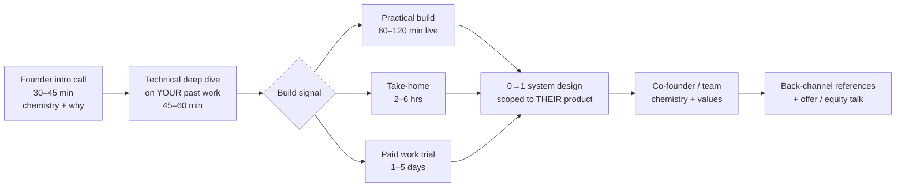

# Day 01 — What founding engineers are actually evaluated on; the loop shape; your one-breath narrative
*Week 1: The game, and 0→1 design foundations · ~60 minutes · 2026-10-05*

**Why this matters in a founding-engineer interview** — A founder hiring engineer #1–3 is not filling a role; they are betting a large slice of their runway and a meaningful slice of equity on one person's judgment. Every round in the loop is a proxy for one question — *"If I left this person alone with the product for a month, would I be glad when I came back?"* — and if you prepare for a big-company loop instead, you will answer a different question very well and still lose.

---

## 1. Primer (10 min)

### The mental model: you are being hired as a co-owner of risk

At LinkedIn, an engineer is evaluated on *execution within a system*: the roadmap, the platform teams, the on-call rotation, the review process all exist already. A founding engineer is evaluated on *building the system itself*, while the product is still wrong and the company might die in 18 months.

That shifts what interviewers look for. Roughly, founders score candidates on six things (this is my synthesis of common founder rubrics, not a published standard):

| Signal | What the founder is really asking | What evidence looks like |
|---|---|---|
| **Shipping velocity with judgment** | Will you get to *working* fast, and cut the right corners? | "I shipped X in N days; here's what I deliberately didn't build" |
| **Ownership under ambiguity** | Do you need a spec, or do you write one? | Stories where nobody asked you, you noticed, you fixed |
| **Product judgment** | Will you build what users need, or what's interesting? | You talk about users, metrics, and kill decisions, not just tech |
| **Breadth** | Can you cover backend, frontend, infra, data, on-call — alone? | You've touched every layer of something that ran in production |
| **Team-building** | Can you hire and raise engineers #2–#5 and set the bar? | Mentoring, hiring loops you designed, culture you shaped |
| **Founder chemistry / trust** | Can I argue with you at 11pm and still like you? | Candour, spiky-but-reasoned opinions, aligned risk appetite |

### Key vocabulary

- **Founding engineer** — usually employee #1–5, pre-seed to Series A. Title often means "senior IC who will become tech lead or first EM", but not always. Clarify which in every process.
- **Work trial** — a paid 1–5 day stint working on the real codebase. Common in US/remote YC-style startups; less common but growing in India.
- **Back-channel** — informal reference checks the founder runs through their own network, not the references you give. At this stage they matter more than at big companies.
- **Bar-raiser in reverse** — at a startup, *you* are partially the bar. The founder is checking whether people they hire after you will want to work for/with you.

### The typical loop (shape varies; this is the common pattern)

India-specific wrinkle (based on public interview reports; varies by company): many India startups, especially fintech and those with ex-FAANG founders, still keep a DSA/coding screen early in the loop. Global-remote AI-infra startups lean harder on practical builds and work trials. Ask on the first call: *"What does the full loop look like, and what does a strong signal in each round look like to you?"* — that question is itself a positive signal.

---

## 2. Deep dive (25 min)

### 2.1 How the six signals map onto rounds

Each round is primarily testing one or two signals, but founders score *every* signal in *every* round. The most common failure mode for big-company candidates is treating a round as narrowly as its label.

| Round | Primary signal | Secondary signals they're silently scoring |
|---|---|---|
| Founder intro | Chemistry, "why" | Product judgment (do you ask about their users?), ownership |
| Deep dive on past work | Breadth, ownership | Did *you* do it, or the team? Can you explain trade-offs you didn't choose? |
| Practical build | Velocity with judgment | Cutting scope out loud; testing the failure path; readable code |
| 0→1 design | Sequencing, scope cuts | Whether you design for 100 users or 100M by reflex |
| Team/co-founder | Team-building, culture | Will engineers #2–5 want to work for you? |
| References | All of it | Consistency between your story and how others describe you |

### 2.2 The LinkedIn translation problem

Five years at LinkedIn is a real asset — you have seen what breaks at scale, and that's exactly the knowledge a startup lacks. But big-company habits produce answers that sound *wrong* in a founding interview. The fix is not to hide the experience; it's to translate it.

| Big-company answer (reads as a negative signal) | Founding-engineer translation |
|---|---|
| "We had a platform team that handled deploys." | "I've seen what a good deploy platform does, so I know which 20% to build myself on day one: one-command deploy and one-command rollback." |
| "I'd write a design doc and get it reviewed by the architecture group." | "For a reversible decision I'd decide in an hour and write a 10-line ADR. For the irreversible ones — data model, auth, the ledger — I'd spend a day." |
| "I'd shard by member ID from the start." | "At LinkedIn scale we sharded by member ID. Here, single Postgres gets us to roughly the first several thousand customers; I'd pick a tenant key now so sharding later is a migration, not a rewrite." |
| "My team delivered…" | "I personally did X; the team did Y; here's the decision I owned." |
| "I mentored several engineers." | "I took an engineer from needing daily check-ins to owning a service end-to-end in ~6 months; here's specifically how." (Have the real numbers ready.) |

The pattern: **name the scale experience, then show you know what to *not* carry over.** Founders want someone who has seen the cliff, not someone who builds a guardrail on a flat road.

### 2.3 What changes between pre-seed (employee #1) and Series A (employee #5–10)

Same title, different job. Calibrate your answers to the stage — ask early.

| | Pre-seed / seed, employee #1–2 | Series A, employee #5–10 |
|---|---|---|
| Team | You + 1–2 founders, maybe one technical | 4–10 engineers, maybe a CTO |
| What they fear | Building the wrong thing; running out of runway before PMF | Systems falling over as revenue scales; hiring mistakes |
| Your best stories | 0→1 speed, solo ownership, talking to users | Scale war stories (LinkedIn), reliability, mentoring/hiring |
| Typical comp shape (rough, India, label as estimate) | Lower cash, materially larger equity (often ~0.5–2%+ for #1) | Closer-to-market cash, smaller equity (often ~0.1–0.5%) |
| Red flag if you say | "I'd set up Kubernetes and a service mesh" | "We don't need tests yet" |

*(Equity ranges vary widely by company, sector and location — treat these as a rough starting frame only; Week 11 covers this properly.)*

Your profile is unusually well-suited to the **seed-to-Series-A seam**: big enough that reliability and scale matter, small enough that 0→1 speed still matters. Say that explicitly.

### 2.4 The one-breath narrative

Every loop starts with some version of "tell me about yourself." The founder decides within ~60 seconds which bucket you're in — *"big-co engineer exploring"* or *"builder who happens to have big-co experience."* The one-breath narrative is a ~30-second (~75–90 word) answer that puts you in the second bucket and gives them three threads to pull.

**Structure (four beats):**

1. **Identity claim** — one line, what kind of engineer you are, framed for *their* problem.
2. **Scale proof** — the LinkedIn line, compressed, with one number.
3. **0→1 proof** — something you built alone, end to end, with a concrete hard detail.
4. **Why this, why now** — the bridge to their company.

**Worked example — draft, for you to rewrite in your own voice:**

> "I'm a backend engineer who's spent five years at LinkedIn operating systems at scale — [*one concrete system + one number you can defend*]. The thing I've gotten obsessed with is how systems fail: on my own I built a real-time market-data pipeline end to end — auth, websocket ingest, reconnect logic — and the failure path taught me more than the happy path; I ended up writing patches for two broker SDKs because of bugs I hit. I want to do that at a company where I own the whole system, which is why [*their product*] caught my eye."

Why this works:
- **"How systems fail"** is a spiky, specific identity — not "full-stack engineer passionate about…". It's also true and backed by your essay theme.
- The NSE system is **story fuel, not the headline**: it proves solo end-to-end building and a taste for hard failure modes, without inviting a "so did it make money?" conversation. If they ask, the honest answer ("I measured it rigorously and found no edge, so I stopped — here's how I knew") is itself a judgment story.
- The OSS patches are **third-party-verifiable** evidence. Founders love evidence they can click.
- Every clause is a thread they can pull, and you have a 2-minute story behind each one.

**Threads you must be ready to pull for 2 minutes each:**

| Thread | Your 2-minute story |
|---|---|
| "Operating at scale" | A LinkedIn incident or migration, with your specific decision and a number |
| "How systems fail" | The 1,426-reconnect storm → IP-block → anti-reconnect-storm gate + 429 backoff ladder |
| "Patches for two SDKs" | DhanHQ-py #65 (event-loop-unsafe `MarketFeed` → `run_async()`, loop rebinding); pykiteconnect #232 (TLS without SNI → `optionsForClientTLS`, proven via loopback ClientHello capture) |
| "Own the whole system" | Why leave LinkedIn (Day 33 goes deep — today, have a one-line version) |

Be precise about status: say "I submitted patches" unless you can show they're merged. Founders will click.

### 2.5 Failure modes that sink strong engineers

1. **The résumé recital.** Chronological walk through jobs. The founder stops listening by job two. Lead with the identity claim.
2. **"We" without "I".** At LinkedIn, team credit is good culture. Here, it hides the signal. Use "I" for decisions you owned, "we" for outcomes.
3. **Scale-first reflex.** Designing for 10M users when they have 40 customers tells them you'll burn runway on infra.
4. **No questions about users.** If you get through the intro call without asking who the customer is and what they pay for, you've failed the product-judgment check silently.
5. **Agreeing with everything.** Founders test for whether you'll push back. A reasoned disagreement ("I'd actually not build X yet, because…") is a positive signal.

---

## 3. Exercise (15 min)

**Task: write, time and stress-test your one-breath narrative.**

1. **(5 min)** Fill this evidence matrix in a scratch file. One line per cell, real facts only — no adjectives.

   | Signal | My strongest evidence | A number I can defend | Gap? |
   |---|---|---|---|
   | Velocity with judgment | | | |
   | Ownership under ambiguity | | | |
   | Product judgment | | | |
   | Breadth | | | |
   | Team-building | | | |
   | Chemistry / spiky opinion | | | |

2. **(5 min)** Write your one-breath narrative using the four beats. Hard limit: **90 words**. Fill the LinkedIn slot with a real system and a real number.
3. **(5 min)** Say it out loud with a timer, twice. Then for each clause, write the one question a founder would most likely ask next, and confirm you have a story behind it.

**Done looks like:**
- An evidence matrix where every cell has a concrete fact, and **every "Gap?" cell is honestly marked** (expect team-building and product judgment to be thinner — that's the point; Weeks 5–6 fill them).
- A narrative of ≤90 words that you can say in **25–35 seconds** without reading.
- A list of 4 follow-up questions, each with a story title you can expand to 2 minutes.

Save it somewhere you'll find it (it becomes the seed of Day 84's capstone pitch).

---

## 4. Interview drill (10 min)

**Q1 (0→1). "Tell me about something you built from zero, alone."**

Model answer

Pick the real-time market-data system, but structure it as *decisions*, not features.

"I built a real-time market-data pipeline for Indian equities on my own — broker auth, websocket ingestion, persistence, a small API and dashboard. Three decisions I'd highlight. First, I made auth zero-touch: the broker required a daily OTP, so I implemented TOTP auto-login with a pure-stdlib TOTP so a missed morning didn't kill the day. Second, reconnects: early on, a bad reconnect loop fired 1,426 reconnects and got my IP blocked by the broker. I added a gate that refuses to reconnect faster than a budget allows, plus a backoff ladder that treats 429s as a penalty, not a retry signal. Third — and this is the judgment part — I measured the trading strategy on it honestly, found it had no edge, and parked it rather than keep tuning. The engineering was the asset; the strategy wasn't, and I'd rather know that in weeks than in a year."

Why it's strong: specific numbers, a real incident, a deliberate stop decision (judgment), and it doesn't oversell.

**Q2 (scale). "You've been at LinkedIn for five years. Won't you over-engineer everything here?"**

Model answer

"It's the right worry. What LinkedIn actually gave me is a list of what breaks first — and that's mostly *not* what people over-build for. At your stage I'd build one Postgres, one deployable service, boring queues, and spend the reliability budget on three things that bite early: idempotency on anything that touches money or external calls, timeouts on every network call, and a one-command rollback. Things I'd deliberately not build yet: sharding, microservices, a custom platform. The skill isn't knowing how to build the big version; it's knowing which two decisions are expensive to change later — usually the data model and the tenant boundary — and getting only those right now."

**Q3 (judgment / what NOT to build). "If you joined Monday, what would you refuse to do in your first 30 days?"**

Model answer

"I'd refuse to rewrite anything I didn't yet understand, refuse to add infrastructure that doesn't map to a current customer pain, and refuse to start hiring before I can describe the bar in writing. What I *would* do: ship something small to production in week one so I learn the deploy path, sit in on customer calls, and write down the top three things that page us or slow us down. Then I'd come back to you with a short list of what to fix and what to leave alone, with reasons. Usually the most valuable early output is a decision about what we're *not* doing."

**Q4 (chemistry). "Why do you want to be a founding engineer rather than a staff engineer at a big company?"**

Model answer

"Because the work I enjoyed most was the work with the most ownership — where I saw the failure, decided the fix, and lived with the result. At LinkedIn that happens inside a large system someone else designed. I've spent my own time building end to end and found I care about the whole loop: the user, the failure mode, the deploy, the follow-up. I want to be the person who sets the engineering defaults for a company, and I want to do it at a stage where those defaults still matter — while also being honest that I'm trading cash certainty for equity and scope, and I've thought about that trade."

Avoid: anything that sounds like running *away* from LinkedIn (bureaucracy complaints). Frame it as running *toward* ownership.

**Q5 (team-building). "How would you hire engineer #2?"**

Model answer

"Start by writing down what #2 needs to be good at that I'm not — probably frontend depth or ML, depending on the roadmap. Then design a short loop that matches the real job: a paid practical build on a cut-down version of our codebase, a deep dive on something they built, and a values conversation with you. I'd source mostly through network and people whose public work I've seen — OSS contributors, people who wrote good postmortems. The bar: would I trust them alone with production for a week? I've mentored several engineers at LinkedIn, and the clearest predictor of who grew fastest was who wrote things down and asked precise questions, so I'd test for that."

**Common mistakes that sink candidates**
- **Answering the label, not the question.** "Tell me about yourself" is a test of judgment about what matters, not a biography. Treat every question as "show me how you think."
- **Unfalsifiable claims.** "I'm very ownership-driven" scores zero. "I noticed X, nobody asked, I fixed it, here's the result" scores. Every adjective needs a story behind it.

---

## 5. Go further (optional)

- Paul Graham, **"Do Things that Don't Scale"** (July 2013) — the founder mindset you're being screened against: https://paulgraham.com/ds.html
- Will Larson, **"Staff archetypes"** — useful for articulating which kind of senior engineer you are (tech lead / architect / solver), and therefore which founding role fits: https://staffeng.com/guides/staff-archetypes
- Will Larson, *Staff Engineer: Leadership beyond the management track* (book) — skim the stories section (interviews with staff engineers) for how senior ICs describe their impact as concrete stories rather than titles.

## Tomorrow
Day 2 — The 0→1 design method: requirements → v1 monolith + Postgres → sequencing → what you'd refuse to build.
